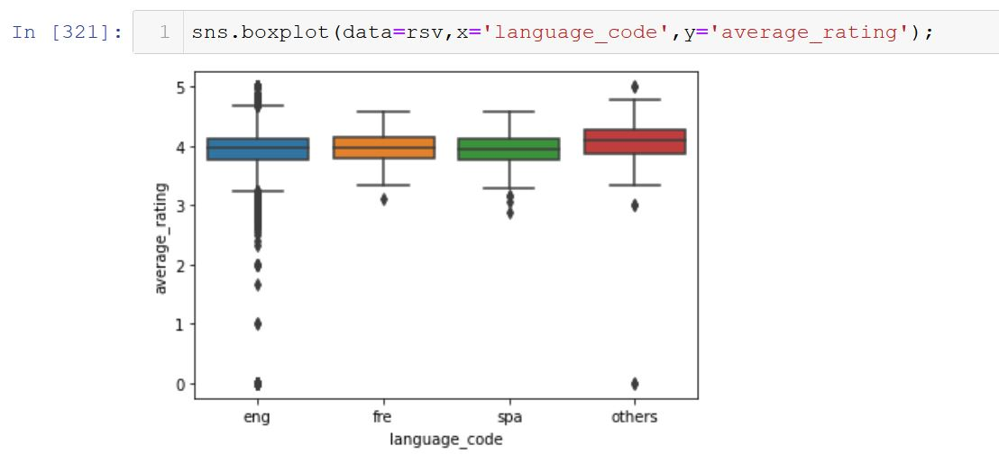
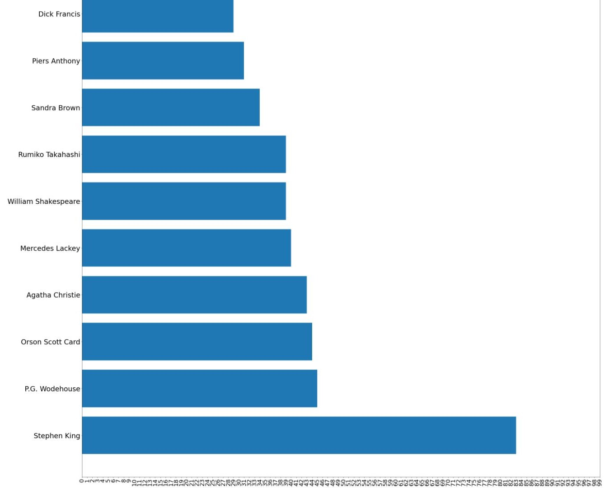
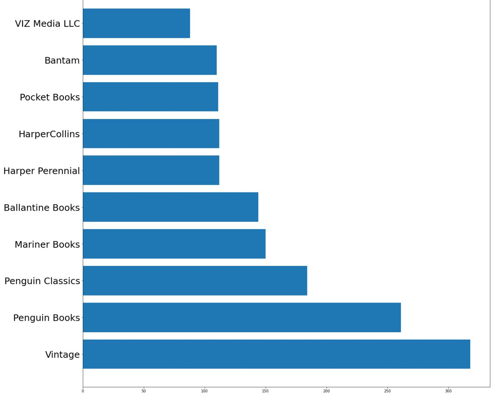

## Data analysis

This repo is aimed to exploration and getting the story and the important 
information within the dataset, Thus plots and the recommender system 

## Goals

* ~~To add more explained graphs~~
* ~~To show the ratings, writers and Genre~~
* ~~Thus finally a recommender system~~ based on different prespectives

## Update

* Only title encoded is considered for now

## Analysis report

* It can be found inside the ipynb file

### Quantitative

*From the graph below we can see that english readers have rated the books on the all margins and other languages are mostly rated above 4.0

* From Below graph it is clear that stephen king has written 83 books within considered dataset

* From Below graph we can see Vintage publication and Penguin publication has the first 2 maximum number of books

Note:-> ``For who do not have jupyter notebook added python file``
